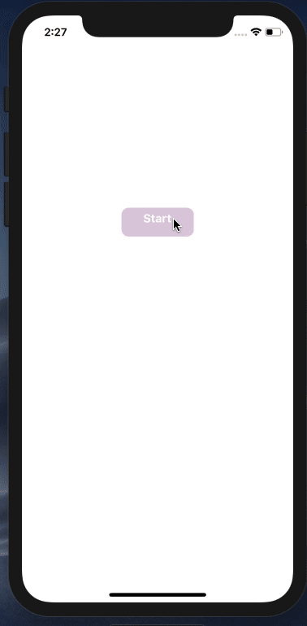
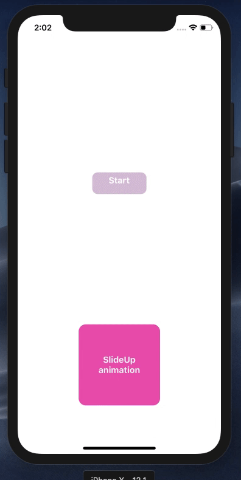
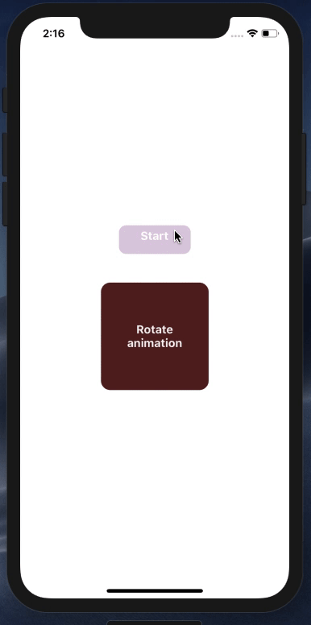
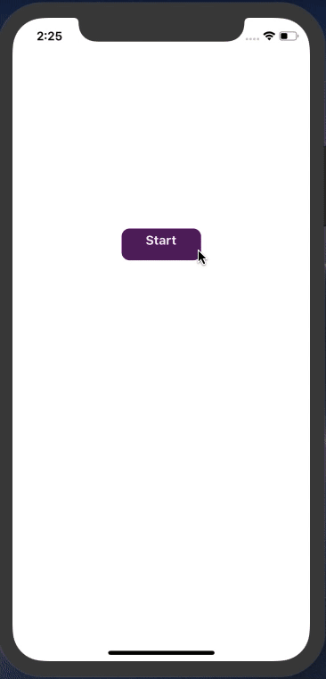
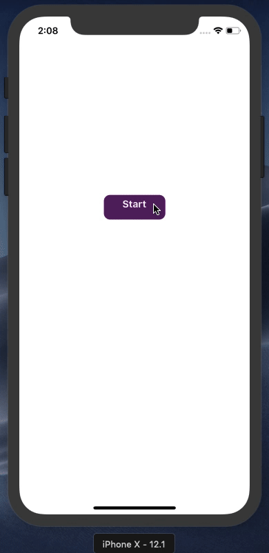

## React Native animations library that makes using react-native animations API easy 🚀







# Installation ⚓️

- NPM

```
npm -i rnal --save
```

- Yarn

```
yarn add rnal
```

# Simply usage 💪🏽 🙌

## 🎈 Fade 🎈

```
import { Fade } from "rnal";
export default class App extends Component<Props, State> {

  render() {

    return (
      <View style={{flex:1}}>
        <Fade >
          <Image
            source={require("./images/flowrs.jpg")}
            height={200}
            width={450}
            style={{ width: 350, height: 200 }}
            resizeMode="cover"
          />
        </Fade>
      </View>
    );
  }
}


```

## Options and props 🎁

| Props     | Value   | Default           | Description                                                                                   |
| --------- | ------- | ----------------- | --------------------------------------------------------------------------------------------- |
| duration  | number  | 300               | Play the audio track that matches the system language. If none match, play the first track.   |
| startWhen | boolean | false             | set when the animation should start, by default the animation start when the component mount. |
| infinite  | boolean | false             | Determine if the animation is infinite or just run once.                                      |
| direction | string  | 300               | specify the direction of the animation ex("toRight", "toLeft", "up","down).                   |
| sets      | Object  | `{from:0,to:180}` | set the point start and the end of the animation, used with `Rotate` animation .              |
